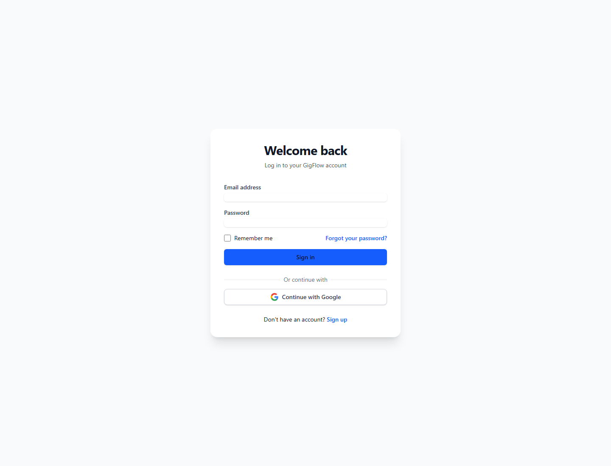

# GigFlow

GigFlow is a freelance automation platform for discovering gigs, tracking opportunities, and generating AI-powered proposals. The repository contains both the full web app and a Chrome extension version of the workflow.

## Overview

GigFlow helps freelancers:

- Scrape freelance opportunities from Mostaql and Khamsat
- Review and organize gigs by status
- Match opportunities against their profile skills
- Generate Arabic or English AI proposals
- Track performance with analytics and KPIs
- Use a browser extension to keep the workflow close to the job boards

## Repository structure

- `gigflow_-freelance-automation/` — full-stack React + Express + Prisma app
- `gigflow-extension/` — Chrome/Edge extension build
- `playground/` — exploration and accessibility demo area
- `docs/screenshots/` — README screenshots

## Demo account

Use the demo login to explore the app without setting up a local account:

- Email: `demo@gigflow.local`
- Password: `GigFlowDemo2026!`

## Screenshots

### Login



### Dashboard


## Features

### Automation app

- AI proposal generation with Gemini
- Gig status tracking: NEW, VIEWED, APPLIED, ARCHIVED
- Skill-based match scoring
- Scraper support for Mostaql and Khamsat
- Analytics dashboard with performance metrics
- Theme switching between dark and light mode
- Profile and settings persistence

### Browser extension

- Side panel interface for quick gig review
- Quick access to the same gig handling flow
- Local storage and extension-aware actions

## Quick start

### 1) Web app

```bash
cd gigflow_-freelance-automation
npm install
npm run dev
```

Open http://localhost:3000

### 2) Extension

```bash
cd gigflow-extension
npm install
npm run build
```

Then load the generated `dist/` folder in Chrome using the Extensions Developer Mode.

## Environment

The automation app expects a Gemini API key in `.env.local`:

```env
GEMINI_API_KEY=your_key_here
```

## Tech stack

- React 19
- TypeScript
- Vite
- Express
- Prisma + SQLite
- Tailwind CSS
- Gemini AI
- Chrome extension tooling

## GitHub

Repository: https://github.com/SoYama350/Gig-flow.git

## License

This project is provided as a portfolio/demo project for freelance workflow automation.
