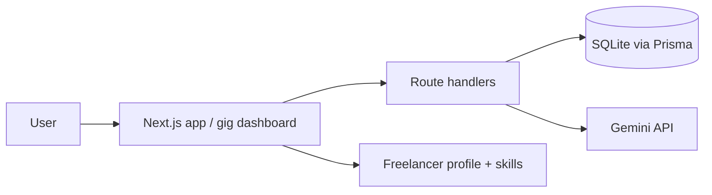

# GigFlow

GigFlow is a freelancer-facing gig workflow that helps users discover relevant opportunities, review requirements, and turn raw job briefs into polished, tailored proposals with AI assistance.

## Project overview

GigFlow helps freelancers research job opportunities, quickly assess match quality, and generate professional proposals without manual copy-paste work. The core user is a freelance professional tracking leads across gig platforms and needing a faster way to turn incoming work into a credible, relevant proposal.

### Problem it solves

Freelancers often lose time juggling gig listings, matching their skills to project requirements, and writing individual proposals. GigFlow reduces that friction by organizing gig data, surfacing skill matches, and drafting a proposal using the gig brief plus the user profile.

### Why this exists

The app was built to turn a useful gig workflow into a production-ready product that proves how AI can help with a real task rather than acting as a generic chatbot.

## Features

- Scrapes and tracks gig opportunities from supported platforms
- Filters gig listings by status and search terms
- Highlights skill match strength against the user profile
- Generates AI-assisted Arabic or English proposals
- Lets users review, edit, and save the generated proposal
- Tracks status transitions such as new, viewed, applied, and archived

## AI integration

GigFlow uses Google Gemini via `@google/genai` with the `gemini-2.0-flash` model in [web/src/services/ai.ts](web/src/services/ai.ts).

The AI is used in the core workflow when a user chooses to generate a proposal for a gig. The prompt combines:

- the gig title, description, budget, and required skills
- the freelancer’s profile and skills
- the preferred output language (`arabic` or `english`)

The model output is not trusted blindly. The app normalizes the response, strips wrapper text, validates minimum length, and checks the output against the selected language. That structured validation sits in `normalizeProposalText()` and `generateProposal()`.

### Failure handling

The app safely handles:

- missing `GEMINI_API_KEY`
- malformed AI output
- empty or too-short responses
- rate-limit/time-out failures
- invalid external payload structure

If the request fails, the UI shows a user-visible error state instead of exposing a stack trace or raw server details.

## Tech stack

- Next.js 15 App Router
- React 19
- TypeScript
- Tailwind CSS v4
- Prisma + SQLite
- Google Gemini API
- Vitest + Testing Library

## Architecture



The frontend is the Next.js app, the backend is the App Router API layer, and the main database is SQLite with Prisma. AI output is generated by the Gemini provider and validated before it is displayed or saved.

## Local setup

### Prerequisites

- Node.js 20+
- npm

### Install and run

```bash
cd web
npm install
cp .env.example .env.local
npm run dev
```

### Required environment variables

Set the following values in `.env.local` for the full app:

```env
GEMINI_API_KEY="your_key_here"
JWT_SECRET="your_strong_secret"
APP_URL="http://localhost:3000"
```

Do not prefix the AI key or JWT secret with `NEXT_PUBLIC_`.

## Testing

```bash
cd web
npm test
npm run test:coverage
```

The project includes component tests for the main gig workflow and AI validation tests for empty, malformed, and missing-key cases.

## Deployment

This app is designed for Vercel because it supports the Next.js App Router and server-side API routes. The runtime environment must include the same server-only variables listed in `.env.example`.

For local verification:

```bash
cd web
npm run build
```

Production deployment requires a Vercel project linked to the repository and the environment variables configured in the Vercel dashboard.

## Accessibility

The app was reviewed with semantic HTML, keyboard flow checks, and browser accessibility inspection of the main screens. The key improvement in the main gig flow was making controls explicit, labeled, and understandable for assistive technology.

## Performance

The app is intentionally lightweight and avoids unnecessary client-side complexity. A real Lighthouse run was attempted, but the environment blocked Chrome temp-directory cleanup, so no fabricated score is claimed. The honest result is: the app compiles successfully and runs locally, but a completed Lighthouse score requires a less restricted browser environment.

## Known limitations

- External AI requests depend on a valid `GEMINI_API_KEY`.
- The app is designed for Vercel-hosted production execution rather than static GitHub Pages export, because API routes are not compatible with static export.
- A fully automated browser audit requires a local environment without the temp-directory permission issue.

## Future improvements

- Add a wider automated test suite for the auth flows and scraper behavior.
- Introduce user-configurable AI tuning and proposal templates.
- Expand gig source providers and richer analytics dashboards.

